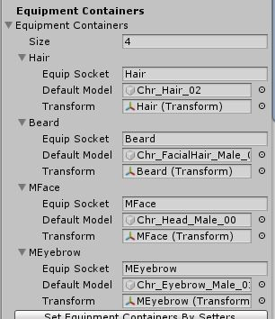
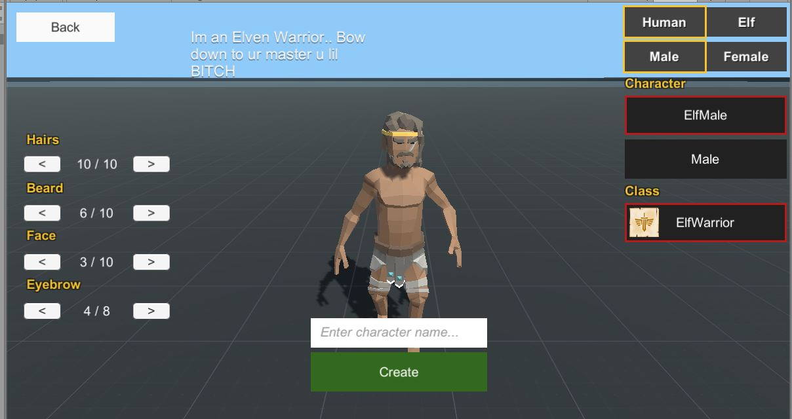

# MMORPG_CharacterCreationAddon
 Codes and Scenes to Modify you Character at run time. Tested with Synty models

This Addon is Copyrighted by Callepo granting permission for it to be used for personal reasons or commercial.
Anyone who takes it and tries to sell to other people will be handled accordingly.

Donations are welcome 
Paypal: xxCallepoxx@gmail.com

Kit Version 1.50C is recommended
Tested with FantasyHeroes pack from Synty ( this asset is not included.. )
If you setuo your prefabs right it should work with all models that have Facial textures that you can swap

Tested in Singple player and Mmo mode (Multiplayer) 

For information bout how Races work check this thread
https://github.com/insthync/UnityMultiplayerARPG_CharacterRace

Just Import the Asset File you get when you download the Files

You need 4 charactermodels at all times
There are 2 Races and 2 Genders.. meaning 1 model per race and gender 
So aka 4
With these 4 if you have enough prefabs for costumization you can make over 100 different models in game

Setting up the Slots for you Characters so it can equip the items on your model

On the player models you will find the PlayerCharacterEntity script where you can set Genders and Race for your models

These are the Armour Types needed to Desstinguish your Prefabs from each other.. basically saying which is which

These are the items that need to be inserted into the database so the game knows what he can use.. 
Right now there are 2 of each in the database.. Game auto checks them and fill the list.. and shows 2 in game
If your add more it auto updates to how ever much u put

Have Fun.

