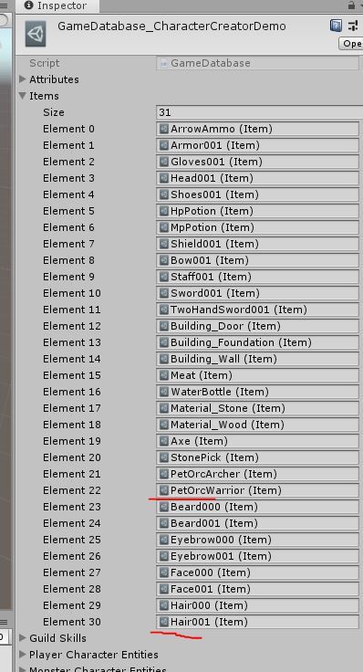
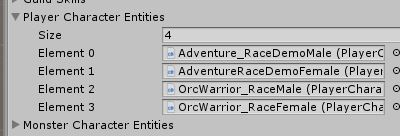
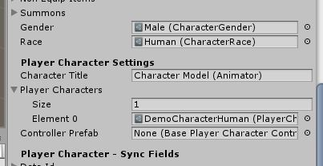
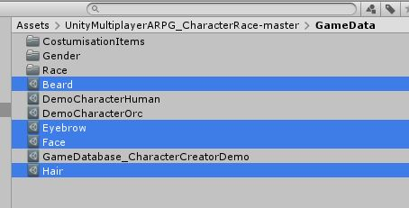
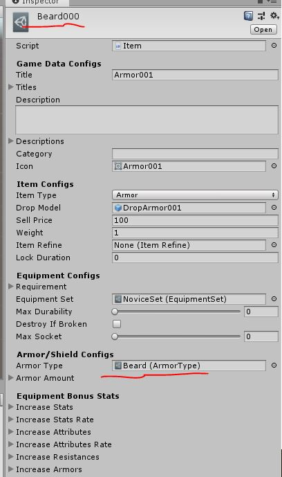

# MMORPG_CharacterCreationAddon
 Codes and Scenes to Modify ur Character at run time. Tested with Synty models
These are the Items that the addon uses to setup ur List of Facial prefabs in the Creation UI

This addon currently only works on Unity version 2019.2.12
Kit Version 1.50C is recommended
Tested with FantasyHeroes pack from Synty
I will Fix this and update it later for it to work on more version

Just Import the Asset File u get when u download the Files

U need 4 charactermodels at all times
There are 2 Races and 2 Genders.. u need 1 model per race and gender 
So aka 4
With these 4 if u have enough prefabs for costumization u can make over 100 different models in game

On the player models u find the PlayerCharacterEntity script where u can set Genders and Race for ur models

These are the Armour Types needed to Desstinguish ur Prefabs from each other.. basically saying which is which

These are the items that need to be inserted into the database so the game knows what he can use.. 
Right now there are 2 of each in the database.. Game auto checks them and fill the list.. and shows 2 in game
If u add more it auto updates to how ever much u put

Have Fun.

Donations are welcome 
Paypal: xxCallepoxx@gmail.com
